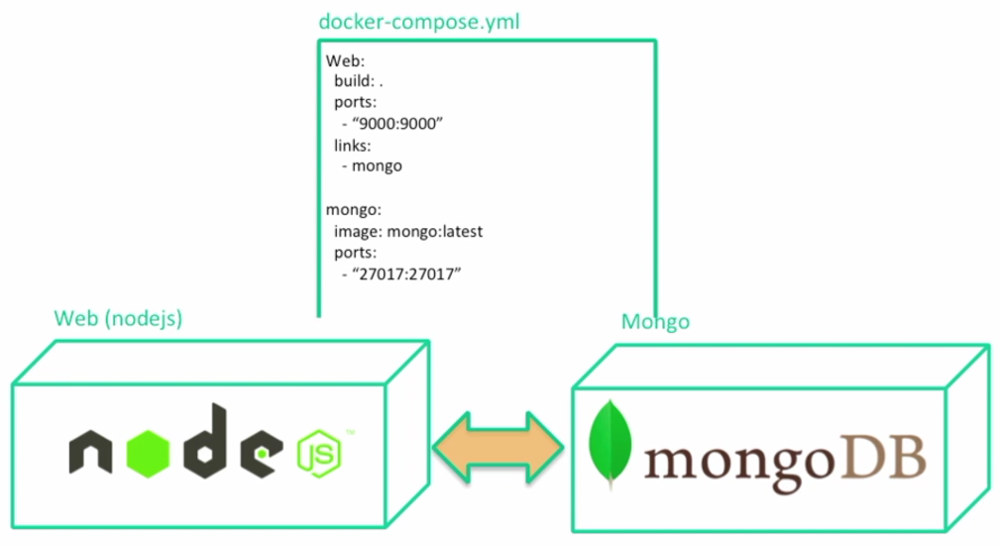

# Docker Compose

Let's run 2 containers, one with Nodejs and the other Mongo:



## Manual Approach

First we will do everything manually before using **docker compose**.

Within [express-angular-mongo](../express-angular-mongo) we start with the simplest Dockerfile:

```bash
$ FROM nodejs:0.2
```

```bash
$ docker build -t web:0.1 .
Sending build context to Docker daemon  245.8kB
Step 1/1 : FROM nodejs:0.2
# Executing 3 build triggers
...
```

Run Mongo:

```bash
$ docker run -d -p 27017:27017 mongo:latest
ba06c8df1ae8ddf42c44f3bdc778da63455117fe84f7cb69790787e654949edc
```

How will our nodejs microservice connect to this running instance of Mongo?

Take a look at [database.js](../express-angular-mongo/config/database.js):

```javascript
var mongourl = process.env.MONGO_URI? process.env.MONGO_URI : 'mongodb://mongo:27017/exampleDb';

module.exports = {
	// mongo database connection url
	url : mongourl
};
```

We need to provide an environment variable (though actually the default is good enough):

```bash
$ docker run -it -p 3000:3000 -e "MONGO_URI=mongodb://mongo:27017/test" web:0.1
```

## Docker Compose Approach

Take a look at [docker-compose.yml](../express-angular-mongo/docker-compose.yml):

```yaml
version: "3.7"

services:
  mongo:
    image: mongo:latest
    ports:
      - 27017:27017
    networks:
      - webappnetwork

  web:
    build: .
    ports:
      - 3000:3000
    environment:
      PORT: 3000
      MONGO_URI: "mongodb://mongo:27017/exampleDb"
    depends_on:
      - mongo
    networks:
      - webappnetwork

networks:
  webappnetwork:
    driver: bridge
```

```bash
$ docker-compose up
```

Note, if there are any issues, first try:

```bash
$ docker-compose build
```

