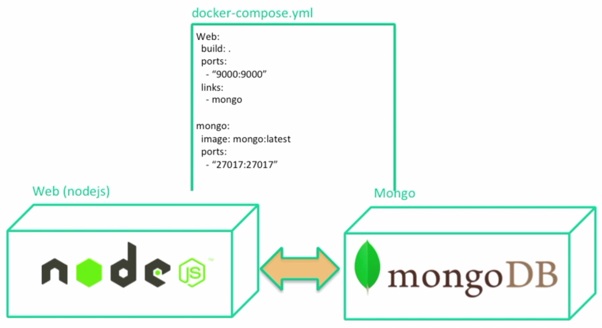

# Docker Compose

Let's run 2 containers, one with Nodejs and the other Mongo:



## Manual Approach

First we will do everything manually before using **docker compose**.

Within [express-angular-mongo](../express-angular-mongo) we start with the simplest Dockerfile:

```bash
$ FROM nodejs:0.2
```

```bash
$ docker build -t web:0.1 .
Sending build context to Docker daemon  245.8kB
Step 1/1 : FROM nodejs:0.2
# Executing 3 build triggers
...
```

Run Mongo:

```bash
$ docker run -d -p 27017:27017 mongo:latest
ba06c8df1ae8ddf42c44f3bdc778da63455117fe84f7cb69790787e654949edc
```

How will our nodejs microservice connect to this running instance of Mongo?

Take a look at [database.js](../express-angular-mongo/config/database.js):

```javascript
var mongourl = process.env.MONGO_URI? process.env.MONGO_URI : 'mongodb://mongo:27017/exampleDb';

module.exports = {
	// mongo database connection url
	url : mongourl
};
```

We need to provide an environment variable (though actually the default is good enough):

```bash
$ docker run -it -p 3000:3000 -e "MONGO_URI=mongodb://mongo:27017/test" web:0.1
```

## Docker Compose Approach

Take a look at [docker-compose.yml](../express-angular-mongo/docker-compose.yml) under folder [express-angular-mongo](../express-angular-mongo):

```yaml
version: "3.7"

services:
  mongo:
    image: mongo:latest
    ports:
      - 27017:27017
    networks:
      - webappnetwork

  web:
    build: .
    ports:
      - 3000:3000
    environment:
      PORT: 3000
      MONGO_URI: "mongodb://mongo:27017/exampleDb"
    depends_on:
      - mongo
    networks:
      - webappnetwork

networks:
  webappnetwork:
    driver: bridge
```

```bash
$ docker-compose up
```

Note, if there are any issues, first try:

```bash
$ docker-compose build
```

## More Docker Compose

Here we shall work in folder [demochat](../demochat), with this first version of a docker-compose manifest:

```yaml
version: "3.7"

services:
  mongo:
    image: mongo

  web:
    build: .
    ports:
      - 5000:5000
    depends_on:
      - mongo
```

```bash
$ docker-compose build
```

```bash
$ docker images
REPOSITORY             TAG                 IMAGE ID            CREATED             SIZE
demochat_web           latest              4be96d895ff0        12 seconds ago      883MB
...
```

Interesting. We used **build: .** for our web service. We could have included **image:** which would stipulate the name of the image to build, but since we did not, docker compose takes the name of the service, **web**, and prefixes it with the **[name of folder]_**, in this case **demochat_web**.

```bash
$ docker-compose up
Creating network "demochat_default" with the default driver
Creating demochat_mongo_1 ... done
Creating demochat_web_1   ... done
Attaching to demochat_mongo_1, demochat_web_1
...
```

and access the application at [localhost:5000](http://localhost:5000):


Let's enhance our [docker-compose.yml](../demochat/docker-compose.yml):

```yaml
version: "3.7"

services:
  mongo:
    image: mongo

  web:
    build:
      context: .
      dockerfile: Dockerfile
    image: web:0.1
    ports:
      - 5000:5000
    depends_on:
      - mongo
```

And now we have:

```bash
$ docker images
REPOSITORY             TAG                 IMAGE ID            CREATED             SIZE
web                    0.1                 cbbed18f8474        4 minutes ago       883MB
demochat_web           latest              4be96d895ff0        21 minutes ago      883MB
```

```bash
$ docker-compose up
```

For a clean tear down:

```bash
$ docker-compose down
Stopping demochat_web_1   ... done
Stopping demochat_mongo_1 ... done
Removing demochat_web_1   ... done
Removing demochat_mongo_1 ... done
Removing network demochat_default
```

## Docker Compose Networks

Take a look, and run, [docker-compose-networks.yml](../docker-compose-networks.yml):

```yaml
version: "3.7"

services:
  service1:
    image: ubuntu
    command: sleep 3600
    networks:
      - default
      - internal1

  service2:
    image: ubuntu
    command: sleep 3600
    networks:
      - internal1

  service3:
    image: ubuntu
    command: sleep 3600
    networks:
      - default

networks:
  internal1:
    driver: bridge      
```

**service1** can connect to both **service2** and **service3**.

However, **service2** and **service3** can only connect to **service1**.

```bash
$ docker-compose -f docker-compose-networks.yml up
Creating network "containers-101_default" with the default driver
Creating network "containers-101_internal1" with driver "bridge"
Creating containers-101_service1_1 ... done
Creating containers-101_service2_1 ... done
Creating containers-101_service3_1 ... done
Attaching to containers-101_service3_1, containers-101_service2_1, containers-101_service1_1
```

```bash
$ docker ps
CONTAINER ID     IMAGE       COMMAND             PORTS         NAMES
e326887419d4     ubuntu      "sleep 3600"                      containers-101_service1_1
10de9a2f7d2a     ubuntu      "sleep 3600"                      containers-101_service2_1
4907246d3fab     ubuntu      "sleep 3600"                      containers-101_service3_1
```

Jump onto container with **service1** where we should be able to ping **service2** and **service3**:

```bash
$ docker exec -it containers-101_service1_1 /bin/bash

root@e326887419d4:/# apt-get update

root@e326887419d4:/# apt-get install -y iputils-ping
Reading package lists... Done
...
root@e326887419d4:/# ping service2
PING service2 (192.168.176.2) 56(84) bytes of data.
64 bytes from containers-101_service2_1.containers-101_internal1 (192.168.176.2): icmp_seq=1 ttl=64 time=0.087 ms
64 bytes from containers-101_service2_1.containers-101_internal1 (192.168.176.2): icmp_seq=2 ttl=64 time=0.166 ms
64 bytes from containers-101_service2_1.containers-101_internal1 (192.168.176.2): icmp_seq=3 ttl=64 time=0.097 ms
...

root@e326887419d4:/# ping service3
PING service3 (192.168.160.2) 56(84) bytes of data.
64 bytes from containers-101_service3_1.containers-101_default (192.168.160.2): icmp_seq=1 ttl=64 time=0.117 ms
64 bytes from containers-101_service3_1.containers-101_default (192.168.160.2): icmp_seq=2 ttl=64 time=0.165 ms
..
```

Do the same for **service2** where we will not be able to ping **service3**:

```bash
$ docker exec -it containers-101_service2_1 /bin/bash

root@10de9a2f7d2a:/# apt-get update

root@10de9a2f7d2a:/# apt-get install -y iputils-ping
Reading package lists... Done
...

root@10de9a2f7d2a:/# ping service1
PING service1 (192.168.176.3) 56(84) bytes of data.
64 bytes from containers-101_service1_1.containers-101_internal1 (192.168.176.3): icmp_seq=1 ttl=64 time=0.086 ms
64 bytes from containers-101_service1_1.containers-101_internal1 (192.168.176.3): icmp_seq=2 ttl=64 time=0.205 ms
...

root@10de9a2f7d2a:/# ping service3
ping: service3: Name or service not known
```

## Docker Compose Volumes

Take a look, and run, [docker-compose-volumes.yml](../docker-compose-volumes.yml):

```yaml
version: "3.7"

services:
  service1:
    image: ubuntu
    command: sleep 3600
    volumes:
      - data:/data

  service2:
    image: ubuntu
    command: sleep 3600
    volumes:
      - data:/data

volumes:
  data:
    driver: local
```

```bash
$ docker-compose -f docker-compose-volumes.yml up
Creating network "containers-101_default" with the default driver
Creating volume "containers-101_data" with local driver
Creating containers-101_service2_1 ... done
Creating containers-101_service1_1 ... done
Attaching to containers-101_service1_1, containers-101_service2_1
```

```bash
$ docker ps
CONTAINER ID       IMAGE        COMMAND           PORTS         NAMES
5380f04d301c       ubuntu       "sleep 3600"                    containers-101_service1_1
3b663f41f865       ubuntu       "sleep 3600"                    containers-101_service2_1
```

The volume will be shared by both services:

```bash
$ docker exec -it containers-101_service1_1 /bin/bash

root@5380f04d301c:/# ls
bin  boot  data  dev  etc  home  lib  lib64  media  mnt  opt  proc  root  run  sbin  srv  sys  tmp  usr  var

root@5380f04d301c:/# cd data
root@5380f04d301c:/data# touch hello
```

```bash
$ docker exec -it containers-101_service2_1 /bin/bash

root@3b663f41f865:/# ls
bin  boot  data  dev  etc  home  lib  lib64  media  mnt  opt  proc  root  run  sbin  srv  sys  tmp  usr  var

root@3b663f41f865:/# ls data
hello
```

