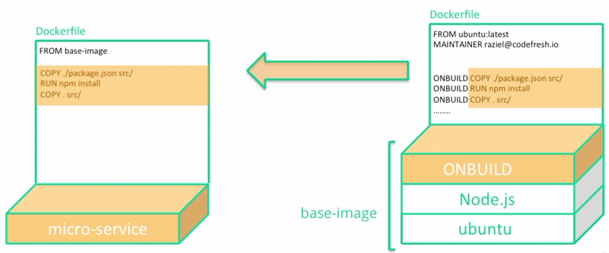

# Docker ONBUILD

The **ONBUILD** instruction adds to the image a trigger instruction to be executed at a later time, when the image is used as the base for another build. The trigger will be executed in the context of the downstream build, **as if it had been inserted immediately after the FROM** instruction in the downstream Dockerfile.



Again we shall work with a nodejs base image:

```bash
$ docker run --rm nodejs:0.1 node -v
v8.10.0
```

We shall rewrite our original Dockerfile (now under folder [archive](../archive)) to use ONBUILD:

```dockerfile
FROM ubuntu:latest

LABEL author = davidainslie

RUN apt-get update
RUN apt-get install -y nodejs npm
RUN apt-get clean

RUN mkdir src/
WORKDIR src/

CMD ["npm", "start"]

ONBUILD COPY ./package.json ./
ONBUILD RUN npm install
ONBUILD COPY . .
```

```bash
$ docker build -t nodejs:0.2 .
```

Let's rewrite our microservice's  Dockerfile to use our new base image that has ONBUILD. Suddenly our microservice Dockerfile is very small:

```dockerfile
FROM nodejs:0.2
```

And build it:

```bash
$ docker build -t microservice:0.1 .
Sending build context to Docker daemon  6.964MB
Step 1/1 : FROM nodejs:0.2
# Executing 3 build triggers
 ---> Running in 5f714dcaa1ef
```

Note our 3 build triggers being executed.

```bash
$ docker images
REPOSITORY           TAG                 IMAGE ID            CREATED              SIZE
microservice         0.1                 865d0981e872        About a minute ago   444MB
nodejs               0.2                 a3699df9c17f        7 minutes ago        425MB
```

Check it, by running it:

```bash
$ docker run --rm -p 3000:3000 microservice:0.1
```

```bash
$ http localhost:3000
HTTP/1.1 200 OK
...
```

