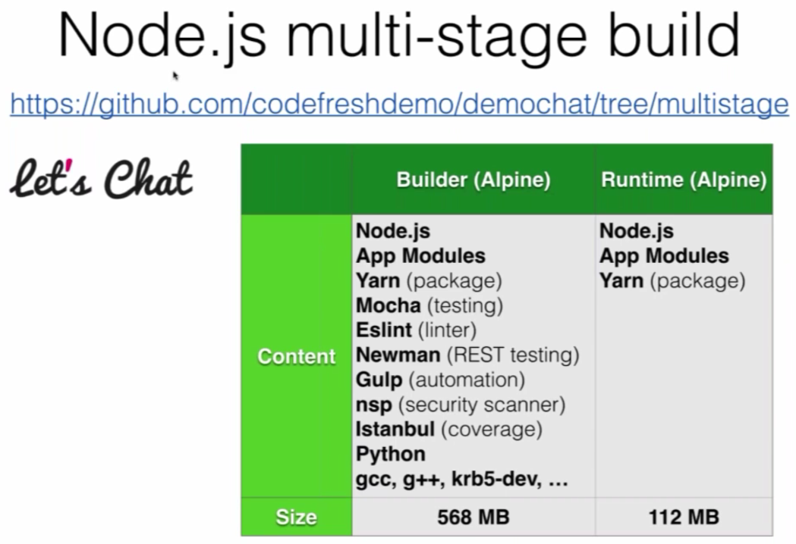

# Multi Stage Build Advanced Pipelines


To avoid the issues of **docker builder pattern**, we instead opt for a **multi stage build**:


---


We shall take the **let's chat** app previously worked upon and convert to a multi stage build:



Let's take a look at the [Dockerfile](../demochat-multi-stage-build/Dockerfile) under [demochat-multi-stage-build](../demochat-multi-stage-build):

```yaml

# ---- Base Node ----
FROM alpine:3.5 AS base

# Install node
RUN apk add --no-cache nodejs-current tini
# Set working directory
WORKDIR /root/demochat
# Set tini as entrypoint
ENTRYPOINT ["/sbin/tini", "--"]
# Install yarn
RUN npm config set depth 0 && npm install --global yarn && npm cache clean
# Copy project file and yarn lock
COPY package.json .
COPY yarn.lock .

# ---- Dependencies ----
FROM base AS dependencies

# Install compilers for node_gyp
RUN apk add --no-cache python make g++ krb5-dev

# Install node packages
RUN yarn config set depth 0
RUN yarn install --ignore-engines --production
# Copy production node_modules aside
RUN cp -R node_modules /prod_node_modules
# Install ALL node_modules
RUN yarn install --ignore-engines

# ---- Test ----
FROM dependencies AS test
COPY . .
# Run eslinter
RUN yarn lint
# Scan code for security violations
RUN yarn scan
# Run mocha tests
RUN yarn test

# ---- Release ----
FROM base AS release

# Copy production node_modules
COPY --from=dependencies /prod_node_modules ./node_modules
# Copy app sources
COPY . .
# Expose port and define CMD
EXPOSE 5000
CMD yarn start
```

