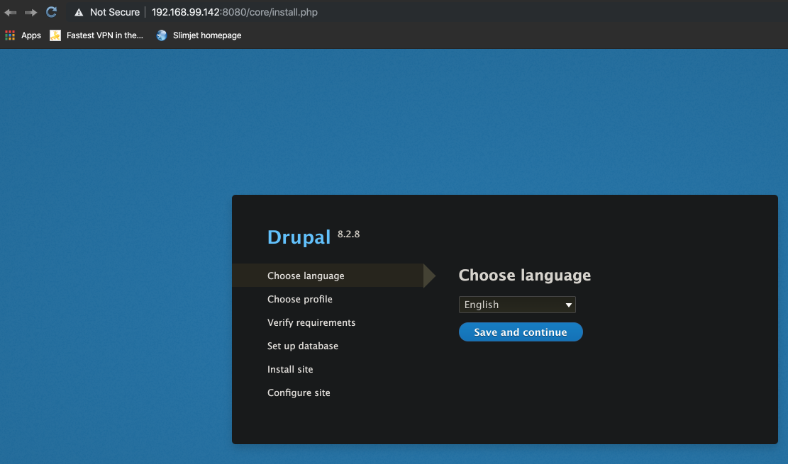

# Assignment 10 - Create Stack with Secrets

- Docker compose file with Drupal
- Add secret via **external:**
- User environment variable **POSTGRES_PASSWORD_FILE**
- Add secret via cli **echo "<password>" | docker secret create psql-pw -**
- Copy compose yaml onto Swarm node 1

[docker-compose](docker-compose.yml) file is:

```yaml
version: "3.7"

services:
  drupal:
    image: drupal:8.2
    ports:
      - 8080:80
    depends_on:
      - postgres
    volumes:
      - drupal-modules:/var/www/html/modules
      - drupal-profiles:/var/www/html/profiles
      - drupal-sites:/var/www/html/sites
      - drupal-themes:/var/www/html/themes

  postgres:
    image: postgres:9.6
    environment:
      POSTGRES_PASSWORD_FILE: /run/secrets/psql-pw
    secrets:
      - psql-pw
    volumes:
      - drupal-data:/var/lib/postgresql/data

secrets:
  psql-pw:
    external: true

volumes:
  drupal-modules:
  drupal-profiles:
  drupal-sites:
  drupal-themes:
  drupal-data:

```

With our nodes up and running copy onto node 1:

```bash
➜ docker-machine scp docker-compose.yml docker@node1:~/
```

Deploy... without having created the necessary secret:

```bash
docker@node1:~$ docker stack deploy -c docker-compose.yml drupal
Creating network drupal_default
service postgres: secret not found: psql-pw
```

So create the secret:

```bash
docker@node1:~$ echo "blah" | docker secret create psql-pw -
qjthnlxjxnhy6ja8grfpmnotu
```

And try again:

```bash
docker@node1:~$ docker stack deploy -c docker-compose.yml drupal
Creating service drupal_drupal
Creating service drupal_postgres
```

```bash
docker@node1:~$ docker stack ps drupal
ID              NAME                IMAGE               NODE           DESIRED STATE
xqb48nnf147t    drupal_postgres.1   postgres:9.6        node2          Running
uhgeyc1fte1h    drupal_drupal.1     drupal:8.2          node1          Running
```

To open a browser pointing at **node 1 port 8080** we need that node's IP:

```bash
➜ docker-machine ls
NAME      ACTIVE   DRIVER       STATE     URL                         SWARM   DOCKER     ERRORS
default   -        virtualbox   Stopped                                       Unknown
node1     -        virtualbox   Running   tcp://192.168.99.142:2376           v19.03.5
node2     -        virtualbox   Running   tcp://192.168.99.143:2376           v19.03.5
node3     -        virtualbox   Running   tcp://192.168.99.144:2376           v19.03.5
```

