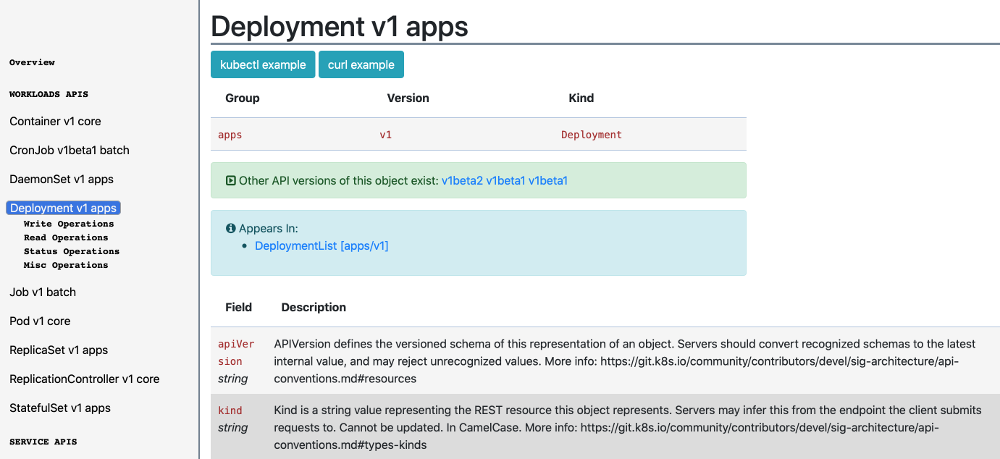

# Declarative YAML

Every manifest requires:

- apiVersion
- kind
- metadata
  - name
- spec

## List resources supported by cluster

```bash
➜ kc api-resources
NAME                         SHORTNAMES  APIGROUP           NAMESPACED  KIND
bindings                                                          true  Binding
componentstatuses               cs                                false ComponentStatus
configmaps                      cm                                true  ConfigMap
endpoints                       ep                                true  Endpoints
events                          ev                                true  Event
limitranges                     limits                            true  LimitRange
namespaces                      ns                                false Namespace
nodes                           no                                false Node
persistentvolumeclaims          pvc                               true  PersistentVolumeClaim
persistentvolumes               pv                                false PersistentVolume
pods                            po                                true  Pod
podtemplates                                                      true  PodTemplate
replicationcontrollers          rc                                true  ReplicationController
resourcequotas                  quota                             true  ResourceQuota
secrets                                                           true  Secret
serviceaccounts                 sa                                true  ServiceAccount
services                        svc                               true  Service
mutatingwebhookconfigurations                                false MutatingWebhookConfiguration
validatingwebhookconfigurations                            false ValidatingWebhookConfiguration
customresourcedefinitions                                        false CustomResourceDefinition
apiservices                              apiregistration.k8s.io   false APIService
controllerrevisions                      apps                     true  ControllerRevision
daemonsets                      ds       apps                     true  DaemonSet
deployments                     deploy   apps                     true  Deployment
replicasets                     rs       apps                     true  ReplicaSet
statefulsets                    sts      apps                     true  StatefulSet
tokenreviews                             authentication.k8s.io    false TokenReview
localsubjectaccessreviews                                        true  LocalSubjectAccessReview
selfsubjectaccessreviews                 authorization.k8s.io     false SelfSubjectAccessReview
selfsubjectrulesreviews                  authorization.k8s.io     false SelfSubjectRulesReview
subjectaccessreviews                     authorization.k8s.io     false SubjectAccessReview
horizontalpodautoscalers        hpa      autoscaling              true  HorizontalPodAutoscaler
cronjobs                        cj       batch                    true  CronJob
jobs                                     batch                    true  Job
certificatesigningrequests      csr                             false CertificateSigningRequest
stacks                                   compose.docker.com       true  Stack
leases                                   coordination.k8s.io      true  Lease
events                          ev       events.k8s.io            true  Event
daemonsets                      ds       extensions               true  DaemonSet
deployments                     deploy   extensions               true  Deployment
ingresses                       ing      extensions               true  Ingress
networkpolicies                 netpol   extensions               true  NetworkPolicy
podsecuritypolicies             psp      extensions               false PodSecurityPolicy
replicasets                     rs       extensions               true  ReplicaSet
ingresses                       ing      networking.k8s.io        true  Ingress
networkpolicies                 netpol   networking.k8s.io        true  NetworkPolicy
runtimeclasses                           node.k8s.io              false RuntimeClass
poddisruptionbudgets            pdb      policy                   true  PodDisruptionBudget
podsecuritypolicies             psp      policy                   false PodSecurityPolicy
clusterrolebindings                   rbac.authorization.k8s.io   false ClusterRoleBinding
clusterroles                          rbac.authorization.k8s.io   false ClusterRole
rolebindings                          rbac.authorization.k8s.io   true  RoleBinding
roles                                 rbac.authorization.k8s.io   true  Role
priorityclasses                 pc       scheduling.k8s.io        false PriorityClass
csidrivers                               storage.k8s.io           false CSIDriver
csinodes                                 storage.k8s.io           false CSINode
storageclasses                  sc       storage.k8s.io           false StorageClass
volumeattachments                        storage.k8s.io           false VolumeAttachment
```

## List API versions

```bash
➜ kc api-versions
admissionregistration.k8s.io/v1beta1
apiextensions.k8s.io/v1beta1
apiregistration.k8s.io/v1
apiregistration.k8s.io/v1beta1
apps/v1
apps/v1beta1
apps/v1beta2
authentication.k8s.io/v1
authentication.k8s.io/v1beta1
authorization.k8s.io/v1
authorization.k8s.io/v1beta1
autoscaling/v1
autoscaling/v2beta1
autoscaling/v2beta2
batch/v1
batch/v1beta1
certificates.k8s.io/v1beta1
compose.docker.com/v1alpha3
compose.docker.com/v1beta1
compose.docker.com/v1beta2
coordination.k8s.io/v1
coordination.k8s.io/v1beta1
events.k8s.io/v1beta1
extensions/v1beta1
networking.k8s.io/v1
networking.k8s.io/v1beta1
node.k8s.io/v1beta1
policy/v1beta1
rbac.authorization.k8s.io/v1
rbac.authorization.k8s.io/v1beta1
scheduling.k8s.io/v1
scheduling.k8s.io/v1beta1
storage.k8s.io/v1
storage.k8s.io/v1beta1
v1
```

## Explain

For services e.g.

```bash
➜ kc explain services --recursive
KIND:     Service
VERSION:  v1
...
```

For deployments e.g.

```bash
➜ kc explain deployments --recursive
KIND:     Deployment
VERSION:  extensions/v1beta1
...
```

Then we can drill down for more details e.g.

```bash
➜ kc explain services.spec
KIND:     Service
VERSION:  v1

RESOURCE: spec <Object>

DESCRIPTION:
     Spec defines the behavior of a service.
...     
```

And go further down:

```bash
➜ kc explain services.spec.type
KIND:     Service
VERSION:  v1

FIELD:    type <string>

DESCRIPTION:
     type determines how the Service is exposed.
...     
```

## API Reference

A nice webpage is the [API reference](https://kubernetes.io/docs/reference/generated/kubernetes-api/v1.17) where you can get examples (templates) for all the different kinds of Kubernetes resources:



