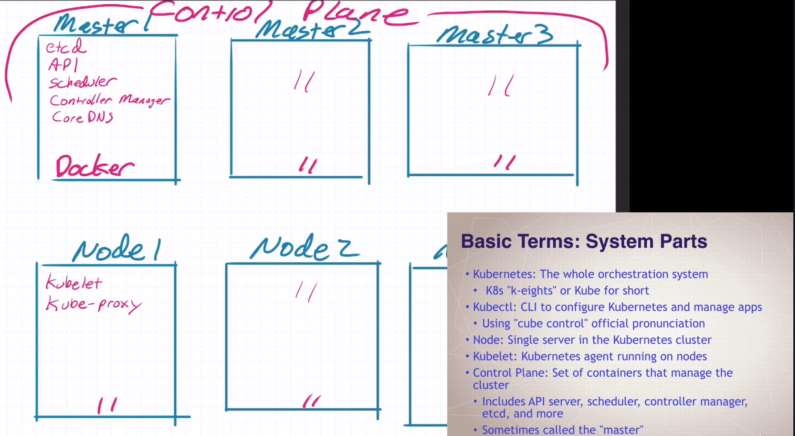
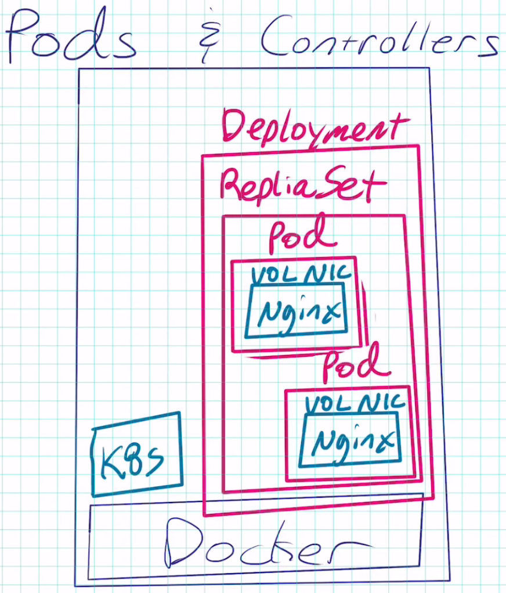
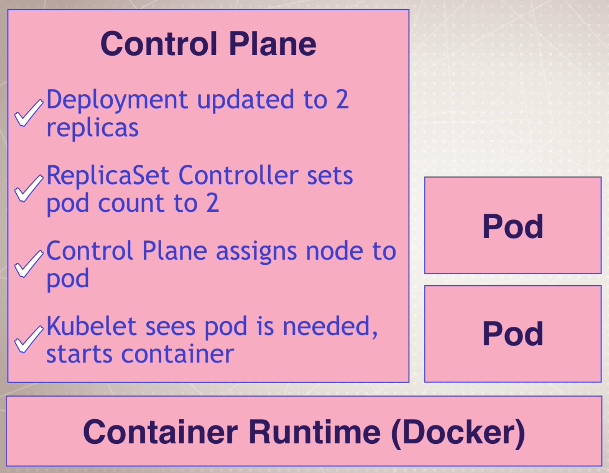

# Kubernetes Introduction



## Some terminology

- Pod: One or more containers running together on one Node
  - Basic unit of deployment - Containers are always in pods
- Controller: For creating/updating pods and other objects
  - Many types of Controllers e.g. Deployment; ReplicaSet; StatefulSet; DaemonSet; Job; CronJob
- Service: Network endpoint to connect to a pod
- Namespace: Filtered group of objects in cluster
- Secrets
- ConfigMaps
- and more...

## Three ways to create pods from CLI

- **kubectl run** - only for pod creation
- **kubectl create** - create some resources via CLI or YAML
- **kubectl apply** - create/update anything via YAML

Give it a go (note that I've aliased **kubectl** to be **kc** for brevity):

```bash
➜ kc run my-nginx --image nginx
deployment "my-nginx" created

➜ kc get all
NAME              DESIRED   CURRENT   UP-TO-DATE   AVAILABLE   AGE
deploy/my-nginx   1         1         1            1           2m

NAME                   DESIRED   CURRENT   READY     AGE
rs/my-nginx-b67c7f44   1         1         1         2m

NAME                         READY     STATUS    RESTARTS   AGE
po/my-nginx-b67c7f44-w9nj8   1/1       Running   0          2m
```



Don't forget to cleanup:

```bash
➜ kc delete deploy/my-nginx
deployment "my-nginx" deleted
```

## Scaling ReplicaSets

```bash
➜ kc run my-apache --image httpd
deployment "my-apache" created
```

Scale this up to 2:

```bash
➜ kc scale deploy/my-apache --replicas 2
deployment "my-apache" scaled
```

```bash
➜ kc get all
NAME                            DESIRED   CURRENT   UP-TO-DATE   AVAILABLE   AGE
deploy/my-apache                2         2         2            2           3m

NAME                            DESIRED   CURRENT   READY     AGE
rs/my-apache-54dc6c76f6         2         2         2         3m

NAME                            READY     STATUS    RESTARTS   AGE
po/my-apache-54dc6c76f6-kkhtm   1/1       Running   0          3m
po/my-apache-54dc6c76f6-rnjsm   1/1       Running   0          29s
```

What happened?



## Inspecting deployment objects

**Logs**:

```bash
➜ kc logs deploy/my-apache
Found 2 pods, using pod/my-apache-54dc6c76f6-kkhtm
AH00558: httpd: Could not reliably determine the server's fully qualified domain name, using 10.1.0.19. Set the 'ServerName' directive globally to suppress this message
AH00558: httpd: Could not reliably determine the server's fully qualified domain name, using 10.1.0.19. Set the 'ServerName' directive globally to suppress this message
[Sun Jan 19 21:25:39.706997 2020] [mpm_event:notice] [pid 1:tid 140129654826112] AH00489: Apache/2.4.41 (Unix) configured -- resuming normal operations
[Sun Jan 19 21:25:39.717053 2020] [core:notice] [pid 1:tid 140129654826112] AH00094: Command line: 'httpd -D FOREGROUND'
```

```bash
➜ kc logs --follow --tail 1 deploy/my-apache
Found 2 pods, using pod/my-apache-54dc6c76f6-kkhtm
[Sun Jan 19 21:25:39.717053 2020] [core:notice] [pid 1:tid 140129654826112] AH00094: Command line: 'httpd -D FOREGROUND'
```

```bash
➜ kc logs -f deploy/my-apache
Found 2 pods, using pod/my-apache-54dc6c76f6-kkhtm
AH00558: httpd: Could not reliably determine the server's fully qualified domain name, using 10.1.0.19. Set the 'ServerName' directive globally to suppress this message
AH00558: httpd: Could not reliably determine the server's fully qualified domain name, using 10.1.0.19. Set the 'ServerName' directive globally to suppress this message
[Sun Jan 19 21:25:39.706997 2020] [mpm_event:notice] [pid 1:tid 140129654826112] AH00489: Apache/2.4.41 (Unix) configured -- resuming normal operations
[Sun Jan 19 21:25:39.717053 2020] [core:notice] [pid 1:tid 140129654826112] AH00094: Command line: 'httpd -D FOREGROUND'
```

As Kubernetes **run command** was kind enough to add a label (**run**) to all our pods for the deployment, we can include said label to get the logs for all pods associated with the deployment:

```bash
➜ kc logs -l run=my-apache
AH00558: httpd: Could not reliably determine the server's fully qualified domain name, using 10.1.0.19. Set the 'ServerName' directive globally to suppress this message
AH00558: httpd: Could not reliably determine the server's fully qualified domain name, using 10.1.0.19. Set the 'ServerName' directive globally to suppress this message
[Sun Jan 19 21:25:39.706997 2020] [mpm_event:notice] [pid 1:tid 140129654826112] AH00489: Apache/2.4.41 (Unix) configured -- resuming normal operations
[Sun Jan 19 21:25:39.717053 2020] [core:notice] [pid 1:tid 140129654826112] AH00094: Command line: 'httpd -D FOREGROUND'
AH00558: httpd: Could not reliably determine the server's fully qualified domain name, using 10.1.0.20. Set the 'ServerName' directive globally to suppress this message
AH00558: httpd: Could not reliably determine the server's fully qualified domain name, using 10.1.0.20. Set the 'ServerName' directive globally to suppress this message
[Sun Jan 19 21:28:11.284739 2020] [mpm_event:notice] [pid 1:tid 139834270741632] AH00489: Apache/2.4.41 (Unix) configured -- resuming normal operations
[Sun Jan 19 21:28:11.285271 2020] [core:notice] [pid 1:tid 139834270741632] AH00094: Command line: 'httpd -D FOREGROUND'
```

Or use **kubetail** or **stern** which are helpful with e.g. syntax colouring and regex:

```bash
➜ kubetail my-apache
Will tail 2 logs...
my-apache-54dc6c76f6-kkhtm
my-apache-54dc6c76f6-rnjsm
```

**Describe** to get details about an object including **events**:

```bash
➜ kc describe po/my-apache-54dc6c76f6-kkhtm
Name:               my-apache-54dc6c76f6-kkhtm
Namespace:          default
Priority:           0
PriorityClassName:  <none>
Node:               docker-desktop/192.168.65.3
Start Time:         Sun, 19 Jan 2020 21:25:22 +0000
Labels:             pod-template-hash=54dc6c76f6
                    run=my-apache
Annotations:        <none>
Status:             Running
IP:                 10.1.0.19
Controlled By:      ReplicaSet/my-apache-54dc6c76f6
Containers:
  my-apache:
    Container ID:   docker://5a20b54740f0ea192188371e8e4d6e0d3714a5e6ee89e8a74884ddb4785d0726
    Image:          httpd
    Image ID:       docker-pullable://httpd@sha256:769018135ba22d3a7a2b91cb89b8de711562cdf51ad6621b2b9b13e95f3798de
    Port:           <none>
    State:          Running
      Started:      Sun, 19 Jan 2020 21:25:39 +0000
    Ready:          True
    Restart Count:  0
    Environment:    <none>
    Mounts:
      /var/run/secrets/kubernetes.io/serviceaccount from default-token-p2tsc (ro)
Conditions:
  Type              Status
  Initialized       True
  Ready             True
  ContainersReady   True
  PodScheduled      True
Volumes:
  default-token-p2tsc:
    Type:        Secret (a volume populated by a Secret)
    SecretName:  default-token-p2tsc
    Optional:    false
QoS Class:       BestEffort
Node-Selectors:  <none>
Tolerations:     node.kubernetes.io/not-ready:NoExecute for 300s
                 node.kubernetes.io/unreachable:NoExecute for 300s
Events:
  Type    Reason     Age   From                     Message
  ----    ------     ----  ----                     -------
  Normal  Scheduled  26m   default-scheduler        Successfully assigned default/my-apache-54dc6c76f6-kkhtm to docker-desktop
  Normal  Pulling    26m   kubelet, docker-desktop  Pulling image "httpd"
  Normal  Pulled     26m   kubelet, docker-desktop  Successfully pulled image "httpd"
  Normal  Created    26m   kubelet, docker-desktop  Created container my-apache
  Normal  Started    26m   kubelet, docker-desktop  Started container my-apache
```

## Watch pods and kill one

In one terminal:

```bash
➜ kc get pods -w
NAME                         READY     STATUS    RESTARTS   AGE
my-apache-54dc6c76f6-kkhtm   1/1       Running   0          30m
my-apache-54dc6c76f6-rnjsm   1/1       Running   0          28m
```

In another terminal:

```bash
➜ kc delete po/my-apache-54dc6c76f6-kkhtm
pod "my-apache-54dc6c76f6-kkhtm" deleted
```

And back in the first terminal, we will see something similar to:

```bash
➜ kc get pods -w
NAME                         READY     STATUS    RESTARTS   AGE
my-apache-54dc6c76f6-kkhtm   1/1       Running   0          30m
my-apache-54dc6c76f6-rnjsm   1/1       Running   0          28m
my-apache-54dc6c76f6-kkhtm   1/1       Terminating   0         36m
my-apache-54dc6c76f6-hdr9r   0/1       Pending   0         0s
my-apache-54dc6c76f6-hdr9r   0/1       Pending   0         0s
my-apache-54dc6c76f6-hdr9r   0/1       ContainerCreating   0         0s
my-apache-54dc6c76f6-kkhtm   0/1       Terminating   0         36m
my-apache-54dc6c76f6-hdr9r   1/1       Running   0         4s
my-apache-54dc6c76f6-kkhtm   0/1       Terminating   0         37m
my-apache-54dc6c76f6-kkhtm   0/1       Terminating   0         37m
```

**Finally, clean up**:

```bash
➜ kc delete deploy/my-apache
deployment "my-apache" deleted
```

