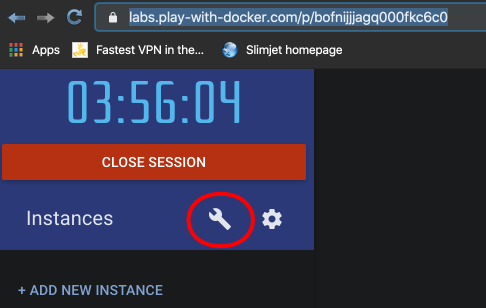
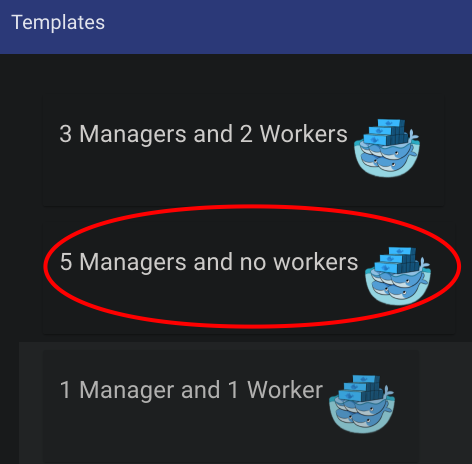
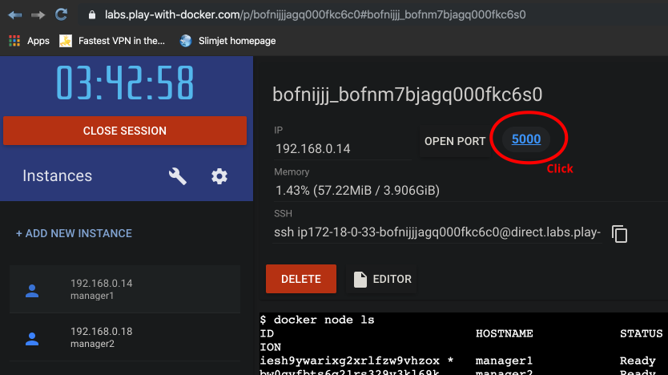
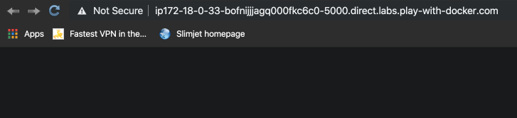
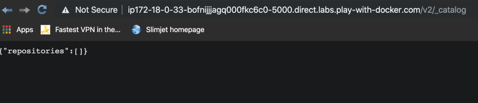
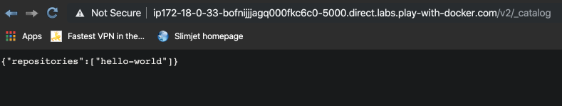

# Dockerhub

## Run a private Docker Registry

- The registry is essentially a HTTP server by default running on port 5000
- We shall run the registry image
- Re-tag an existing image and push to our new registry
- Remove that image from local cache and pull from new registry
- Re-create registry using a bind mount and see how it stores data
- Secure by default - Docker won't talk to registry without HTTPS except for **localhost** (127.0.0.1/8)

Start up the registry, using a dockerhub image called **registry**:

```bash
➜ docker container run -d -p 5000:5000 --name registry registry
08ae5b8436c84b2b6e8bce239ad3d6ca8dff9d179a2e57edf1d5634268d1806b
```

Let's pull an image (from dockerhub):

```bash
➜ docker pull hello-world
Using default tag: latest
latest: Pulling from library/hello-world
1b930d010525: Pull complete
Digest: sha256:d1668a9a1f5b42ed3f46b70b9cb7c88fd8bdc8a2d73509bb0041cf436018fbf5
Status: Downloaded newer image for hello-world:latest
docker.io/library/hello-world:latest
```

Check it, by running it:

```bash
➜ docker run hello-world

Hello from Docker!
This message shows that your installation appears to be working correctly.

To generate this message, Docker took the following steps:
 1. The Docker client contacted the Docker daemon.
 2. The Docker daemon pulled the "hello-world" image from the Docker Hub.
    (amd64)
 3. The Docker daemon created a new container from that image which runs the
    executable that produces the output you are currently reading.
 4. The Docker daemon streamed that output to the Docker client, which sent it
    to your terminal.
```

Now push this image to our new local registry:

```bash
➜ docker tag hello-world 127.0.0.1:5000/hello-world

➜ docker push 127.0.0.1:5000/hello-world
The push refers to repository [127.0.0.1:5000/hello-world]
af0b15c8625b: Pushed
latest: digest: sha256:92c7f9c92844bbbb5d0a101b22f7c2a7949e40f8ea90c8b3bc396879d95e899a
```

Remove the container and then remove from cache:

```bash
➜ docker container ls -a
CONTAINER ID   IMAGE          COMMAND               STATUS                     NAMES
614968fd2fc4   hello-world  "/hello"                Exited (0) 7 minutes ago   reverent_greider
08ae5b8436c8   registry     "/entrypoint.sh /etc…"  Up 14 minutes              registry

➜ docker container rm reverent_greider
reverent_greider

➜ docker image ls
REPOSITORY                   TAG                 IMAGE ID            CREATED             SIZE
...
registry                     latest              f32a97de94e1        10 months ago       25.8MB
127.0.0.1:5000/hello-world   latest              fce289e99eb9        12 months ago       1.84kB
hello-world                  latest              fce289e99eb9        12 months ago       1.84kB

➜ docker image rm hello-world 127.0.0.1:5000/hello-world
Untagged: hello-world:latest
Untagged: hello-world@sha256:d1668a9a1f5b42ed3f46b70b9cb7c88fd8bdc8a2d73509bb0041cf436018fbf5
Untagged: 127.0.0.1:5000/hello-world:latest
Untagged: 127.0.0.1:5000/hello-world@sha256:92c7f9c92844bbbb5d0a101b22f7c2a7949e40f8ea90c8b3bc396879d95e899a
Deleted: sha256:fce289e99eb9bca977dae136fbe2a82b6b7d4c372474c9235adc1741675f587e
Deleted: sha256:af0b15c8625bb1938f1d7b17081031f649fd14e6b233688eea3c5483994a66a3

➜ docker pull 127.0.0.1:5000/hello-world
Using default tag: latest
latest: Pulling from hello-world
1b930d010525: Pull complete
Digest: sha256:92c7f9c92844bbbb5d0a101b22f7c2a7949e40f8ea90c8b3bc396879d95e899a
Status: Downloaded newer image for 127.0.0.1:5000/hello-world:latest
127.0.0.1:5000/hello-world:latest
```

## Run a private Docker Registry with Volume

First clean up (remove our original local registry):

```bash
➜ docker container kill registry
registry

➜ docker container rm registry
registry
```

This time create registry with volume:

```bash
➜ docker container run -d -p 5000:5000 --name registry -v $(pwd)/registry-data:/var/lib/registry registry
397760cd62137bed55632c78eb2fc81625bf57c02f7a98e316f76814caca45f7
```

And push the hello-world image back to this new registry:

```bash
➜ docker push 127.0.0.1:5000/hello-world
The push refers to repository [127.0.0.1:5000/hello-world]
af0b15c8625b: Pushed
latest: digest: sha256:92c7f9c92844bbbb5d0a101b22f7c2a7949e40f8ea90c8b3bc396879d95e899a
```

```bash
➜ ls -las
...
 0 drwxr-xr-x   3 davidainslie  staff    96 14 Jan 21:25 registry-data
```

```bash
➜ tree registry-data
registry-data
└── docker
    └── registry
        └── v2
            ├── blobs
            │   └── sha256
            │       ├── 1b
            │       │   └── 1b930d010525941c1d56ec53b97bd057a67ae1865eebf042686d2a2d18271ced
            │       │       └── data
            │       ├── 92
            │       │   └── 92c7f9c92844bbbb5d0a101b22f7c2a7949e40f8ea90c8b3bc396879d95e899a
            │       │       └── data
            │       └── fc
            │           └── fce289e99eb9bca977dae136fbe2a82b6b7d4c372474c9235adc1741675f587e
            │               └── data
            └── repositories
                └── hello-world
```

## Using Docker Registry with Swarm

Let's do this on [play with docker](https://labs.play-with-docker.com):



---



```bash
[manager1] (local) root@192.168.0.14 ~
$ docker node ls
ID                            HOSTNAME       STATUS    AVAILABILITY    MANAGER STATUS
iesh9ywarixg2xrlfzw9vhzox *   manager1       Ready     Active          Reachable
bw0gyfbts6q21rs329v3kl69k     manager2       Ready     Active          Reachable
5yg8oq046402xoel5i42djlao     manager3       Ready     Active          Reachable
zmab0g1l7x5bo9olvesjixyf9     manager4       Ready     Active          Leader
6en00y26bwqwchh351rgg1jry     manager5       Ready     Active          Reachable
```

Create the registry:

```bash
[manager1] (local) root@192.168.0.14 ~
$ docker service create --name registry --publish 5000:5000 registry
t1myt42qj3dzl1xbykajgcbrf
overall progress: 1 out of 1 tasks 
1/1: running   [==================================================>] 
verify: Service converged
```

```bash
[manager1] (local) root@192.168.0.14 ~
$ docker service ps registry
ID             NAME        IMAGE            NODE      DESIRED STATE  CURRENT STATE
nc4gm9n0amch   registry.1  registry:latest  manager4  Running        Running about a minute ago 
```



---



---



Now pull an image:

```bash
[manager1] (local) root@192.168.0.14 ~
$ docker pull hello-world
Using default tag: latest
latest: Pulling from library/hello-world
1b930d010525: Pull complete 
Digest: sha256:9572f7cdcee8591948c2963463447a53466950b3fc15a247fcad1917ca215a2f
Status: Downloaded newer image for hello-world:latest
docker.io/library/hello-world:latest
```

Tag it:

```bash
[manager1] (local) root@192.168.0.14 ~
$ docker tag hello-world 127.0.0.1:5000/hello-world
```

An push:

```bash
[manager1] (local) root@192.168.0.14 ~
$ docker push 127.0.0.1:5000/hello-world
The push refers to repository [127.0.0.1:5000/hello-world]
af0b15c8625b: Pushed 
latest: digest: sha256:92c7f9c92844bbbb5d0a101b22f7c2a7949e40f8ea90c8b3bc396879d95e899a
```

Refresh the category UI:



Let's do the same with nginx but also create a service:

```bash
[manager1] (local) root@192.168.0.14 ~
$ docker pull nginx

$ docker tag nginx 127.0.0.1:5000/nginx

$ docker push 127.0.0.1:5000/nginx
The push refers to repository [127.0.0.1:5000/nginx]

$ docker service create --name nginx -p 80:80 --replicas 5 --detach=false 127.0.0.1:5000/nginx
qcd2aregqh2i993ha6ffi3hbq
```

And click on the new port (80) at the top of the UI to **Welcome to nginx!**.