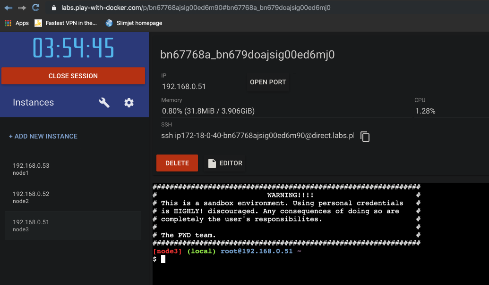

# 3 Node Swarm

## Play with Docker

We are going to use [play-with-docker](https://labs.play-with-docker.com/):



Let's type some stuff into Node 1 console:

```bash
[node1] (local) root@192.168.0.53 ~
$ docker info
Client:
 Debug Mode: false
 Plugins:
  app: Docker Application (Docker Inc., v0.8.0)

Server:
 Containers: 0
...
```

Ping Node 2:

```bash
[node1] (local) root@192.168.0.53 ~
$ ping 192.168.0.52
PING 192.168.0.52 (192.168.0.52): 56 data bytes
64 bytes from 192.168.0.52: seq=0 ttl=64 time=0.186 ms
...
```

From node1 initialise the Swarm:

```bash
[node1] (local) root@192.168.0.53 ~
$ docker swarm init
Error response from daemon: could not choose an IP address to advertise since this system has multiple addresses on different interfaces (192.168.0.53 on eth0 and 172.18.0.17 on eth1) - specify one with --advertise-addr
[node1] (local) root@192.168.0.53 ~
$ docker swarm init 192.168.0.53
"docker swarm init" accepts no arguments.
See 'docker swarm init --help'.

Usage:  docker swarm init [OPTIONS]

Initialize a swarm
[node1] (local) root@192.168.0.53 ~
$ docker swarm init --advertise-addr 192.168.0.53
Swarm initialized: current node (xtgb0v14ryvo52eveyh76ji2p) is now a manager.

To add a worker to this swarm, run the following command:

    docker swarm join --token SWMTKN-1-5wq14ohyggw4j84h0pq2xifb02ua8uj7s2mfb1pj8juhc8z4g8-czlus9pj947f6quwjifgowbkh 192.168.0.53:2377

To add a manager to this swarm, run 'docker swarm join-token manager' and follow the instructions.
```

Copy the **docker swarm join** command and run on node2:

```bash
[node2] (local) root@192.168.0.52 ~
$ docker swarm join --token SWMTKN-1-5wq14ohyggw4j84h0pq2xifb02ua8uj7s2mfb1pj8juhc8z4g8-czlus9pj947f6quwjifgowbkh 192.168.0.53:2377
This node joined a swarm as a worker.
```

Back on node1 we can view the nodes within the Swarm:

```bash
[node1] (local) root@192.168.0.53 ~
$ docker node ls
ID                           HOSTNAME   STATUS   AVAILABILITY   MANAGER STATUS   ENGINE VERSION
xtgb0v14ryvo52eveyh76ji2p *  node1      Ready    Active         Leader           19.03.4
vpn7rjulwlcu09vcmed6nt75q    node2      Ready    Active                          19.03.4
```

Note that we won't be able to run Docker Swarm commands on node2 because it is only a **worker**. However, we could change node2 to be the **master** if so desired:

```bash
[node1] (local) root@192.168.0.53 ~
$ docker node update --role manager node2
```

To get the token (master or worker, which was originally displayed):

```bash
[node1] (local) root@192.168.0.53 ~
$ docker swarm join-token manager
To add a manager to this swarm, run the following command:

    docker swarm join --token SWMTKN-1-5wq14ohyggw4j84h0pq2xifb02ua8uj7s2mfb1pj8juhc8z4g8-4j72xof8peoysckncijgrb01f 192.168.0.53:2377
```

On node3:

```bash
[node3] (local) root@192.168.0.51 ~
$ docker swarm join --token SWMTKN-1-5wq14ohyggw4j84h0pq2xifb02ua8uj7s2mfb1pj8juhc8z4g8-4j72xof8peoysckncijgrb01f 192.168.0.53:2377
This node joined a swarm as a manager.
```

And on node1:

```bash
[node1] (local) root@192.168.0.53 ~
$ docker node ls
ID                           HOSTNAME   STATUS   AVAILABILITY   MANAGER STATUS   ENGINE VERSION
xtgb0v14ryvo52eveyh76ji2p *  node1      Ready    Active         Leader           19.03.4
vpn7rjulwlcu09vcmed6nt75q    node2      Ready    Active                          19.03.4
tpjt82chh11ybt7q32cmvdp8v    node3      Ready    Active         Reachable        19.03.4
```

Finally we can start a service:

```bash
[node1] (local) root@192.168.0.53 ~
$ docker service create --replicas 3 alpine ping 8.8.8.8
ruo2edr03tiifftnx31nzig6d
overall progress: 3 out of 3 tasks 
1/3: running   [==================================================>] 
2/3: running   [==================================================>] 
3/3: running   [==================================================>] 
verify: Service converged
```

```bash
[node1] (local) root@192.168.0.53 ~
$ docker service ls
ID               NAME              MODE           REPLICAS        IMAGE               PORTS
ruo2edr03tii     hungry_spence     replicated     3/3             alpine:latest
```

```bash
[node1] (local) root@192.168.0.53 ~
$ docker node ps
ID            NAME              IMAGE           NODE   DESIRED STATE   CURRENT STATE
uv36093ezscs  hungry_spence.2   alpine:latest   node1  Running         Running 2 minutes ago
```

The service is running on this node (node1). What about say node2?

```bash
[node1] (local) root@192.168.0.53 ~
$ docker node ps node2
ID             NAME              IMAGE          NODE    DESIRED STATE   CURRENT STATE
789k30ohhdq1   hungry_spence.3   alpine:latest  node2   Running         Running 4 minutes ago
```

Let's see the complete picture:

```bash
[node1] (local) root@192.168.0.53 ~
$ docker service ps hungry_spence
ID             NAME              IMAGE           NODE   DESIRED STATE   CURRENT STATE           ERROR               PORTS
wyyu8ryelgrn   hungry_spence.1   alpine:latest   node3  Running         Running 6 minutes ago                       
uv36093ezscs   hungry_spence.2   alpine:latest   node1  Running         Running 6 minutes ago                       
789k30ohhdq1   hungry_spence.3   alpine:latest   node2  Running         Running 6 minutes ago
```

## Docker Machine (Alternative)

With **docker-machine** (comes with docker desktop) and **Virtualbox** installed (as per the [setup](../../../docs/setup.md)) we can start 3 nodes and ssh onto them:

```bash
➜ docker-machine create node1
Running pre-create checks...
Creating machine...
(node1) Copying /Users/davidainslie/.docker/machine/cache/boot2docker.iso to /Users/davidainslie/.docker/machine/machines/node1/boot2docker.iso...
(node1) Creating VirtualBox VM...
(node1) Creating SSH key...
(node1) Starting the VM...
...
```

```bash
➜ docker-machine ssh node1
   ( '>')
  /) TC (\   Core is distributed with ABSOLUTELY NO WARRANTY.
 (/-_--_-\)           www.tinycorelinux.net

docker@node1:~$
```

```bash
➜ docker-machine create node2
Running pre-create checks...
Creating machine...
(node2) Creating VirtualBox VM...
(node2) Creating SSH key...
(node2) Starting the VM...
```

```bash
➜ docker-machine ssh node2
   ( '>')
  /) TC (\   Core is distributed with ABSOLUTELY NO WARRANTY.
 (/-_--_-\)           www.tinycorelinux.net

docker@node2:~$
```

```bash
➜ docker-machine create node3
Running pre-create checks...
Creating machine...
(node3) Creating VirtualBox VM...
(node3) Creating SSH key...
(node3) Starting the VM...
```

```bash
➜ docker-machine ssh node3
   ( '>')
  /) TC (\   Core is distributed with ABSOLUTELY NO WARRANTY.
 (/-_--_-\)           www.tinycorelinux.net

docker@node3:~$
```

So what do we have:

```bash
➜ docker-machine ls
NAME      ACTIVE   DRIVER       STATE     URL                         SWARM   DOCKER     ERRORS
default   -        virtualbox   Stopped                                       Unknown
node1     -        virtualbox   Running   tcp://192.168.99.121:2376           v19.03.4
node2     -        virtualbox   Running   tcp://192.168.99.122:2376           v19.03.4
node3     -        virtualbox   Running   tcp://192.168.99.123:2376           v19.03.4
```

And we can remove/delete say node1 and node2:

```bash
➜ docker-machine rm node1 node2
```

From node1 initialise the Swarm (we'll choose the second IP):

```bash
docker@node1:~$ docker swarm init
Error response from daemon: could not choose an IP address to advertise since this system has multiple addresses on different interfaces (10.0.2.15 on eth0 and 192.168.99.124 on eth1) - specify one with --advertise-addr

docker@node1:~$ docker swarm init --advertise-addr 192.168.99.124
Swarm initialized: current node (52m1yp0qbfsge8x68iajoys7r) is now a manager.

To add a worker to this swarm, run the following command:

    docker swarm join --token SWMTKN-1-2ssr1wjeoa829m5x8t41sg7ovo881vm6hkue4ruc67dw05zoy3-9eo8lqlnizo7votcqggns860e 192.168.99.124:2377

To add a manager to this swarm, run 'docker swarm join-token manager' and follow the instructions.
```

Copy the **docker swarm join** command and run on node2:

```bash
docker@node2:~$ docker swarm join --token SWMTKN-1-2ssr1wjeoa829m5x8t41sg7ovo881vm6hkue4ruc67dw05zoy3-9eo8lqlnizo7votcqggns860e 192.168.99.124:2377
This node joined a swarm as a worker.
```

and for node3:

```bash
docker@node3:~$ docker swarm join --token SWMTKN-1-2ssr1wjeoa829m5x8t41sg7ovo881vm6hkue4ruc67dw05zoy3-9eo8lqlnizo7votcqggns860e 192.168.99.124:2377
This node joined a swarm as a worker.
```

