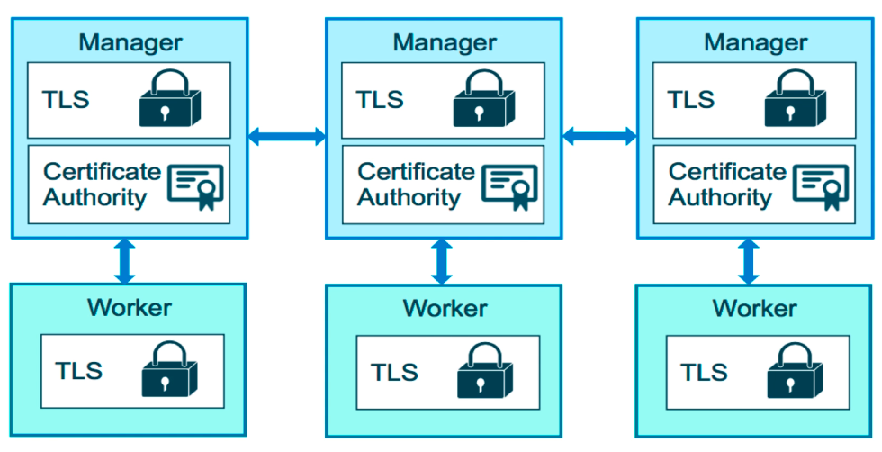
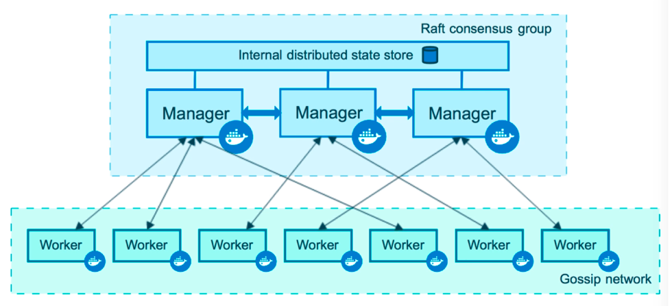
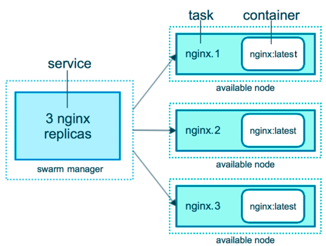
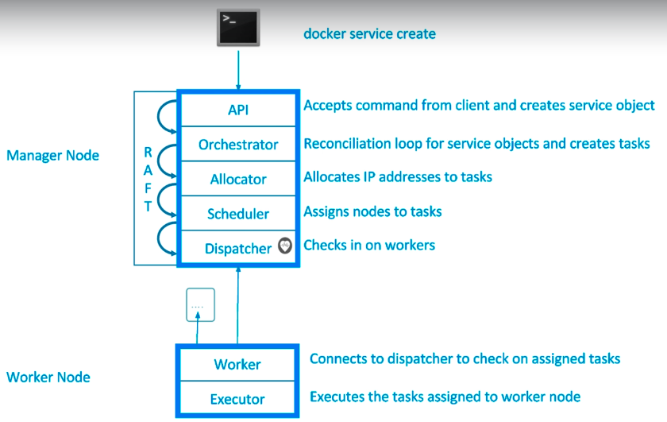

# Swarm Introduction

- How do we automate container lifecycle?
- How can we easily scala out/in/up/down?
- How can we ensure our containers are recreated if they fail?
- How can we replace containers without downtime (blue/green deploy)?
- How can we control/track where containers get started?
- How can we create cross-node virtual networks?
- How can we ensure only trusted servers run our containers?
- How can we store secrets, keys, passwords and get them to the right container (and only that container)?

## Swarm Mode - Built in Orchestration

- Swarm Mode is a clustering solution built inside Docker
- Not enabled by default - new commands once enabled:
  - docker swarm
  - docker node
  - docker service
  - docker stack
  - docker secret

---

---

---

