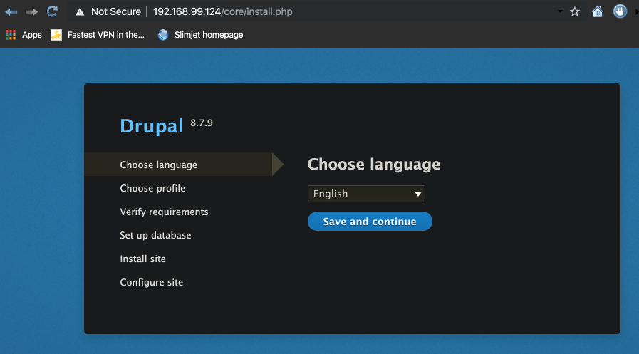

# Scaling Out With Overlay Network

A new type of network for a Swarm:

- Choose **--driver overlay** when creating network
- For container-to-container traffic inside a single Swarm
- Optional IPSec (AES) encryption on network creation
- Each service can be connected to multiple networks e.g. frontend, backend

With our 3 nodes running from [3 Node Swarm](3-node-swarm.md) on the master node:

```bash
docker@node1:~$ docker network create --driver overlay mydrupal
ts0x5nkia9wvne3c5g9bkawvu
```

```bash
docker@node1:~$ docker network ls
NETWORK ID          NAME                DRIVER              SCOPE
d35adbe01cf8        bridge              bridge              local
40b154442318        docker_gwbridge     bridge              local
101ef85bf594        host                host                local
2xe8irr38s3h        ingress             overlay             swarm
ts0x5nkia9wv        mydrupal            overlay             swarm
a7c663f2c682        none                null                local
```

Now create our postgres service on this new network:

```bash
docker@node1:~$ docker service create --name psql --network mydrupal -e POSTGRES_PASSWORD=mypass postgres
4ujfhb5yfhtavberu8lhfio83
overall progress: 1 out of 1 tasks
1/1: running   [==================================================>]
verify: Service converged
```

```bash
docker@node1:~$ docker service ps psql
ID             NAME     IMAGE             NODE   DESIRED STATE       CURRENT STATE
01mxnwleiewj   psql.1   postgres:latest   node3  Running             Running 3 minutes ago
```

And also create our drupal service on said network:

```bash
docker@node1:~$ docker service create --name drupal --network mydrupal -p 80:80 drupal
0oi5gwefrx2si57ehzmewhhh5
overall progress: 1 out of 1 tasks
1/1: running   [==================================================>]
verify: Service converged
```

```bash
docker@node1:~$ docker service ls
ID             NAME      MODE          REPLICAS    IMAGE             PORTS
0oi5gwefrx2s   drupal    replicated    1/1         drupal:latest     *:80->80/tcp
4ujfhb5yfhta   psql      replicated    1/1         postgres:latest
```

```bash
docker@node1:~$ watch docker service ls

Every 2.0s: docker service ls                                                                                                                                                       node1: Thu Nov 14 23:04:43 2019

ID             NAME      MODE          REPLICAS    IMAGE             PORTS
0oi5gwefrx2s   drupal    replicated    1/1         drupal:latest     *:80->80/tcp
4ujfhb5yfhta   psql      replicated    1/1         postgres:latest
```

Now go to browser at the Swarm **adverise-addr** of **192.168.99.12**:

