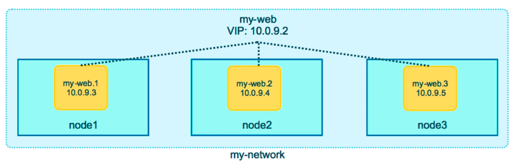
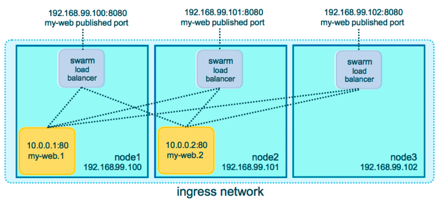

# Scaling Out With Routing Mesh

- Routes ingress (incoming) packets for a Service to proper Task
- Spans all nodes in Swarm
- Uses IPVS from Linux Kernel
- Load balanced Swarm Services across their Tasks
- Two ways this works:
  - Container-to-container in an Overlay network (uses VIP)
  - External traffic incoming to published ports (all nodes listen)



---



## Example

With our 3 nodes up (see [3-node-swarm](3-node-swarm.md)):

```bash
docker@node1:~$ docker service create --name search --replicas 3 -p 9200:9200 elasticsearch:2
tdrwxrr5mte029zodsd599fxg
overall progress: 3 out of 3 tasks
1/3: running   [==================================================>]
2/3: running   [==================================================>]
3/3: running   [==================================================>]
```

```bash
docker@node1:~$ docker service ps search
ID              NAME         IMAGE             NODE    DESIRED STATE     CURRENT STATE
n49xgct0w98z    search.1     elasticsearch:2   node3   Running           Running 3 minutes ago
tmrvvs8cztd2    search.2     elasticsearch:2   node1   Running           Running 3 minutes ago
f3eaj5ziw3bd    search.3     elasticsearch:2   node2   Running           Running 3 minutes ago
```

```bash
docker@node1:~$ curl localhost:9200
{
  "name" : "Autolycus",
  "cluster_name" : "elasticsearch",
  "cluster_uuid" : "hxg_tDIyTWWGPQyUluFtsw",
  "version" : {
    "number" : "2.4.6",
    "build_hash" : "5376dca9f70f3abef96a77f4bb22720ace8240fd",
    "build_timestamp" : "2017-07-18T12:17:44Z",
    "build_snapshot" : false,
    "lucene_version" : "5.5.4"
  },
  "tagline" : "You Know, for Search"
}

docker@node1:~$ curl localhost:9200
{
  "name" : "Benedict Kine",
  "cluster_name" : "elasticsearch",
  "cluster_uuid" : "IVsuk61wRtuiOVNusEE8Gw",
  "version" : {
    "number" : "2.4.6",
    "build_hash" : "5376dca9f70f3abef96a77f4bb22720ace8240fd",
    "build_timestamp" : "2017-07-18T12:17:44Z",
    "build_snapshot" : false,
    "lucene_version" : "5.5.4"
  },
  "tagline" : "You Know, for Search"
}
```

