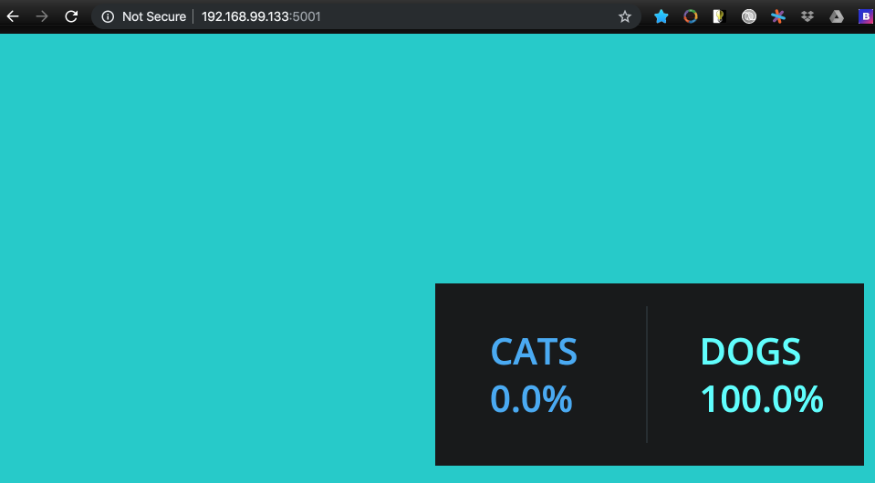

# Stacks - Production Grade Compose

- Stacks accept Compose files as their declarative definition for services, networks and volumes
- Use **docker stack deploy** rather than **docker service create**
- Stacks manages objects for us including overlay network per stack - adds stack name to start of their names
- New **deploy:** key in Compose file - but can't do **build**
  - Compose ignores **deploy:** while Swarm ignores **build:**


Previously we deployed 5 managed services in a somewhat manual/cumbersome approach. Let's now declare a stack with a docker compose file:

```yaml
version: "3"

services:
  redis:
    image: redis:alpine
    ports:
      - 6379
    networks:
      - frontend
    deploy:
      replicas: 1
      update_config:
        parallelism: 2
        delay: 10s
      restart_policy:
        condition: on-failure
 
  db:
    image: postgres:9.4
    volumes:
      - db-data:/var/lib/postgresql/data
    networks:
      - backend
    deploy:
      placement:
        constraints: [node.role == manager]
        
  vote:
    image: bretfisher/examplevotingapp_vote
    ports:
      - 5000:80
    networks:
      - frontend
    depends_on:
      - redis
    deploy:
      replicas: 2
      update_config:
        parallelism: 2
      restart_policy:
        condition: on-failure
        
  result:
    image: bretfisher/examplevotingapp_result
    ports:
      - 5001:80
    networks:
      - backend
    depends_on:
      - db
    deploy:
      replicas: 1
      update_config:
        parallelism: 2
        delay: 10s
      restart_policy:
        condition: on-failure

  worker:
    image: bretfisher/examplevotingapp_worker:java
    networks:
      - frontend
      - backend
    depends_on:
      - db
      - redis
    deploy:
      mode: replicated
      replicas: 1
      labels: [APP=VOTING]
      restart_policy:
        condition: on-failure
        delay: 10s
        max_attempts: 3
        window: 120s
      placement:
        constraints: [node.role == manager]

  visualizer:
    image: dockersamples/visualizer
    ports:
      - 8080:8080
    stop_grace_period: 1m30s
    volumes:
      - /var/run/docker.sock:/var/run/docker.sock
    deploy:
      placement:
        constraints: [node.role == manager]

networks:
  frontend:
  backend:

volumes:
  db-data:
```

Make sure we have our 3 nodes up:

```bash
➜ docker-machine create node1

➜ docker-machine create node2

➜ docker-machine create node3
```

Create Swarm:

```bash
➜ docker-machine ssh node1

docker@node1:~$ docker swarm init
Error response from daemon: could not choose an IP address to advertise since this system has multiple addresses on different interfaces (10.0.2.15 on eth0 and 192.168.99.133 on eth1) - specify one with --advertise-addr
docker@node1:~$ docker swarm init --advertise-addr 192.168.99.133
Swarm initialized: current node (ly4i2we5rmi0mriw238mp1cnq) is now a manager.

To add a worker to this swarm, run the following command:

    docker swarm join --token SWMTKN-1-5biiqj4rba7cpp5k9ioblo4kaoabzmmr7m2h4td03aran6s7sz-42zdw5abnberr1zhwnk8saebz 192.168.99.133:2377
```

On node2:

```bash
➜ docker-machine ssh node2

docker@node2:~$ docker swarm join --token SWMTKN-1-5biiqj4rba7cpp5k9ioblo4kaoabzmmr7m2h4td03aran6s7sz-42zdw5abnberr1zhwnk8saebz 192.168.99.133:2377
```

On node3:

```bash
➜ docker-machine ssh node3

docker@node3:~$ docker swarm join --token SWMTKN-1-5biiqj4rba7cpp5k9ioblo4kaoabzmmr7m2h4td03aran6s7sz-42zdw5abnberr1zhwnk8saebz 192.168.99.133:2377
```

Copy [stack manifest](stack.yml) into node1:

```bash
➜ docker-machine scp voting-app-stack.yml docker@node1:~/
voting-app-stack.yml                                                                                 ...
docker@node1:~$ ls
voting-app-stack.yml
```

And create the [stack](stack.yml).

```bash
docker@node1:~$ docker stack deploy -c voting-app-stack.yml voteapp
Creating network voteapp_backend
Creating network voteapp_default
Creating network voteapp_frontend
Creating service voteapp_worker
Creating service voteapp_visualizer
Creating service voteapp_redis
Creating service voteapp_db
Creating service voteapp_vote
Creating service voteapp_result
```

```bash
docker@node1:~$ docker stack ls
NAME                SERVICES            ORCHESTRATOR
voteapp             6                   Swarm
```

```bash
docker@node1:~$ docker stack ps voteapp
ID            NAME                  IMAGE                                       NODE
ua09tgzbk8ob  voteapp_result.1      bretfisher/examplevotingapp_result:latest   node3
s754sljpkpm2  voteapp_vote.1        bretfisher/examplevotingapp_vote:latest     node2
s8od2h0weq84  voteapp_db.1          postgres:9.4                                node1
2msqyz9vdqbh  voteapp_redis.1       redis:alpine                                node2
k6e49f1fudyl  voteapp_visualizer.1  dockersamples/visualizer:latest             node1
ihkrw17c0y62  voteapp_worker.1      bretfisher/examplevotingapp_worker:java     node1
q32x2149fkf1  voteapp_vote.2        bretfisher/examplevotingapp_vote:latest     node3
```

```bash
docker@node1:~$ docker stack services voteapp
ID           NAME          REPLICAS  IMAGE                                      PORTS
6d7a7qdz7wjm voteapp_worker     1/1  bretfisher/examplevotingapp_worker:java
j74y1qsqw0ye voteapp_visualizer 1/1  dockersamples/visualizer:latest          *:8080->8080/tcp
jdzjze3dvhvg voteapp_redis      1/1  redis:alpine                             *:30000->6379/tcp
nadxxlrf3ieq voteapp_result     1/1  bretfisher/examplevotingapp_result:latest *:5001->80/tcp
on8cp5x2d9il voteapp_vote       2/2  bretfisher/examplevotingapp_vote:latest   *:5000->80/tcp
yx6o07glolks voteapp_db         1/1  postgres:9.4
```

Let's take a look at the application - In order to point our browser at the correct IP:

```bash
➜ docker-machine ls
NAME      ACTIVE   DRIVER       STATE     URL                         SWARM   DOCKER     ERRORS
default   -        virtualbox   Stopped                                       Unknown
node1     -        virtualbox   Running   tcp://192.168.99.133:2376           v19.03.5
node2     -        virtualbox   Running   tcp://192.168.99.134:2376           v19.03.5
node3     -        virtualbox   Running   tcp://192.168.99.135:2376           v19.03.5
```


---



---

